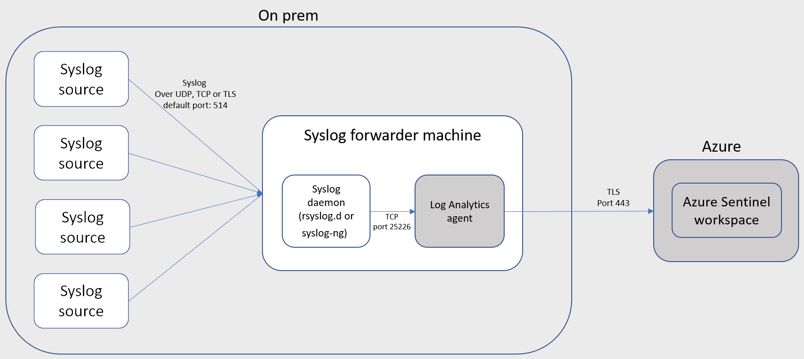
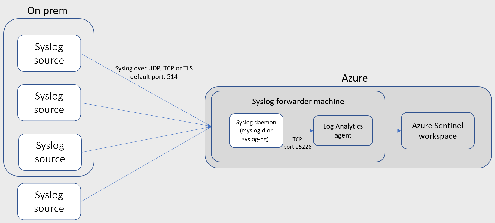
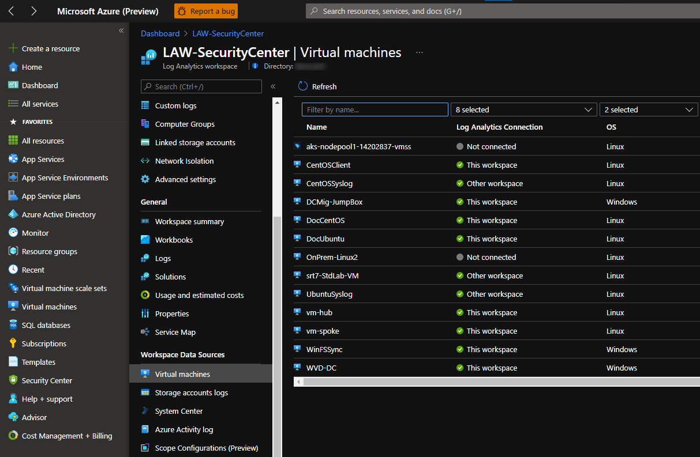
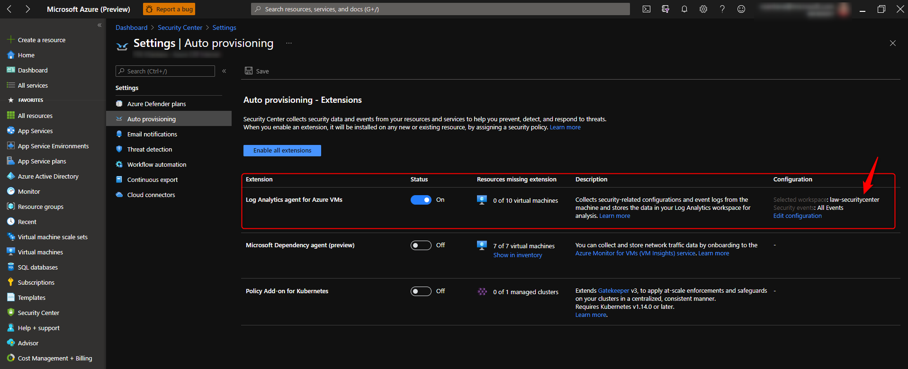
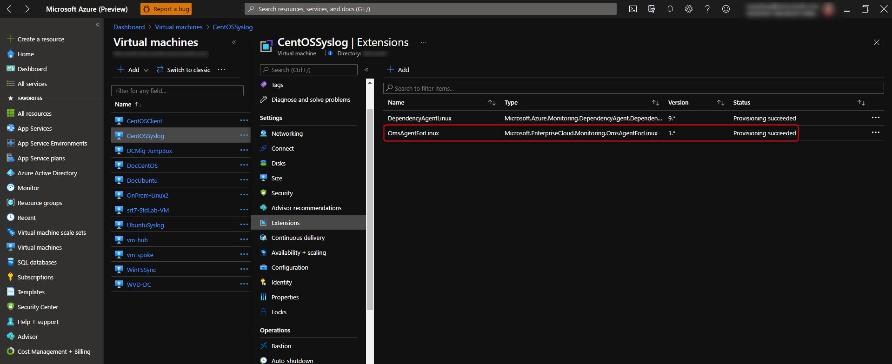
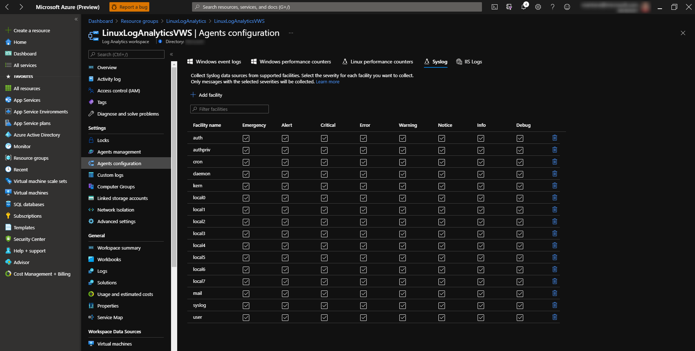
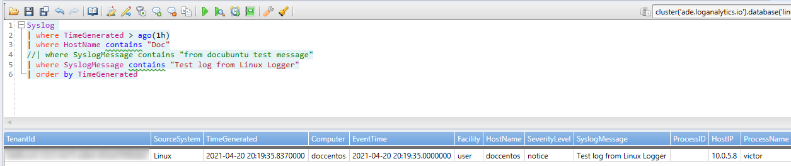

How to collect data to Azure Sentinel using Syslog Server (RSyslog)
===================================================================

Table of Contents
=================

1. [Introduction](https://github.com/Welasco/AzureSentinelSyslog#1-introduction)
1. [What is Syslog?](https://github.com/Welasco/AzureSentinelSyslog#2-what-is-syslog)
1. [What is Log Analytics Agent](https://github.com/Welasco/AzureSentinelSyslog#3-what-is-log-analytics-agent)
1. [Setup Log Analytics agent on Linux (log forward)](https://github.com/Welasco/AzureSentinelSyslog#4-setup-log-analytics-agent-on-linux-log-forward)
1. [Configuring RSyslog to receive messages from Network](https://github.com/Welasco/AzureSentinelSyslog#5-configuring-rsyslog-to-receive-messages-from-network)
1. [Log Analytics agent (OMSAgent) and FluentD](https://github.com/Welasco/AzureSentinelSyslog#6-log-analytics-agent-omsagent-and-fluentd)
1. [Configuring RSyslog and Log Analytics agent to forward Common Event Format (CEF) messages](https://github.com/Welasco/AzureSentinelSyslog#7-configuring-rsyslog-and-log-analytics-agent-to-forward--common-event-format-cef-messages)
1. [Troubleshooting](https://github.com/Welasco/AzureSentinelSyslog#8-troubleshooting)

## 1. Introduction

Azure Sentinel can be connected via an agent to any other data source that can perform real-time log streaming using the Syslog protocol. 

Most appliances use the Syslog protocol to send event messages that include the log itself and data about the log. The format of the logs varies, but most appliances support CEF-based formatting for log data.

The Azure Sentinel agent, which is actually the Log Analytics agent, converts CEF-formatted logs into a format that can be ingested by Log Analytics. Depending on the appliance type, the agent is installed either directly on the appliance, or on a dedicated Linux-based log forwarder. The agent for Linux receives events from the Syslog daemon over UDP, but if a Linux machine is expected to collect a high volume of Syslog events, they are sent over TCP from the Syslog daemon to the agent and from there to Log Analytics.

Here is a diagram of how it works:

You can host the Syslog forwarder server either On-Prem or in Azure VM:

- On-Prem with Log Analytics agent installed:
    

- Azure VM with Log Analytics agent installed:
    

## 2. What is Syslog?

Syslog stands for System Logging Protocol and is a standard protocol used to send system log or event messages to a specific server, called a syslog server. It is primarily used to collect various device logs from several different machines in a central location for monitoring and review.

Syslog is defined in RFC 5424, The Syslog Protocol, which obsoleted the previous RFC 3164:

 - [The Syslog Protocol - RFC5424](https://datatracker.ietf.org/doc/rfc5424/)
 - [The Syslog Protocol - **obsolete** RFC3164](https://datatracker.ietf.org/doc/rfc3164/)

Currently Syslog has two main implementations RSyslog and Syslog-NG.
 - Syslog-NG (1998)
 - RSyslog (2004)

This article will be based in RSyslog.

### Facility

In short, a facility level is used to determine the program or part of the system that produced the logs.
By default, some parts of your system are given facility levels such as the kernel using the kern facility, or your mailing system using the mail facility.
If a third-party wants to issue a log, it would probably a reserved set of facility levels from 16 to 23 called “local use” facility levels.
Alternatively, they can use the “user-level” facility, meaning that they would issue logs related to the user that issued the commands.

| **Facility Number** | **Keyword** | **Facility Description** |
| --- | --- | --- |
| 0 | kern | kernel messages |
| 1 | user | user-level messages |
| 2 | mail | mail system |
| 3 | daemon | system daemons |
| 4 | auth | security/authorization messages |
| 5 | syslog | messages generated internally by syslogd |
| 6 | lpr | line printer subsystem |
| 7 | news | network news subsystem |
| 8 | uucp | UUCP subsystem |
| 9 | cron | clock daemon |
| 10 | authpriv | security/authorization messages |
| 11 |  | FTP daemon |
| 12 |  | NTP subsystem |
| 13 |  | log audit |
| 14 |  | log alert |
| 15 |  | clock daemon (note 2) |
| 16 | local0 | local use 0  (local0) |
| 17 | local1 | local use 1  (local1) |
| 18 | local2 | local use 2  (local2) |
| 19 | local3 | local use 3  (local3) |
| 20 | local4 | local use 4  (local4) |
| 21 | local5 | local use 5  (local5) |
| 22 | local6 | local use 6  (local6) |
| 23 | local7 | local use 7  (local7) |

### Severity

The Severity is one of the following keywords, in ascending order: debug, info, notice, warning, warn
(same as warning), err, error (same as err), crit, alert, emerg, panic (same as emerg).

| **Numerical Code** | **Keyword** | **Severity Description** |
| --- | --- | --- |
| 0 | emerg | Emergency: system is unusable |
| 1 | alert | Alert: action must be taken immediately |
| 2 | crit | Critical: critical conditions |
| 3 | err | Error: error conditions |
| 4 | warning | Warning: warning conditions |
| 5 | notice | Notice: normal but significant condition |
| 6 | info | Informational: informational messages |
| 7 | debug | Debug: debug-level messages |

### Syslog message format

The two values are combined to produce a Priority Value sent with the message. The Priority Value is calculated by multiplying the Facility value by eight and then adding the Severity Value to the result. The lower the PRI, the higher the priority.

```
(Facility Value * 8) + Severity Value = PRI
```

In this way, a kernel message receives lower value (higher priority) than a log alert, regardless of the severity of the log alert. Additional identifiers in the packet include the hostname, IP address, process ID, app name, and timestamp of the message.
The actual verbiage or content of the syslog message is not defined by the protocol. Some messages are simple, readable text, others may only be machine readable.
```
Facility syslog (5), Severity alert (1)
Msg: 1 2021-04-19T15:00:22.303078+00:00 CentOSClient node 444969 123 [timeQuality tzKnown="1" isSynced="1" syncAccuracy="1513"] node test msg

<41>1.2021-04-19T15:00:22.303078+00:00.CentOSClient.node.444969.123.[timeQuality.tzKnown="1".isSynced="1".syncAccuracy="1513"].node.test.msg
```

| **Part** | **Value** | **Information** |
| --- | --- | --- |
PRI | 41 | (5*8)=40 Syslog, 1 = Alert |
VERSION | 1 | Version 1 |
TIMESTAMP | 2021-04-19T15:00:22.303078+00:00 | Message created on Apr, 19, 2021 at 15:00:22, 3 milliseconds into the next second |
HOSTNAME | CentOSClient | Message originated from host 'CentOSClient' |
APP-NAME | node | App Name: node |
PROCID | 444969 | Process ID: 444969 |
MSGID | 123 | Message-ID: 123 |
STRUCTURED-DATA | [timeQuality tzKnown="1" isSynced="1" syncAccuracy="1513"] | Structured Data Element with a non-IANA controlled with 3 parameters timeQuality.tzKnown="1" isSynced="1" syncAccuracy="1513" |
MSG | node test msg | Log message: node test msg |

### Syslog files

Syslog messages can be saved in a file or forwarded to any other system. Using the configuration file you can define where the data should be saved or forwarded using Syslog facilities and severity.

In the following example we are logging anything (expcept mail, authpriv or cron) of level (severity) info or higher to /var/log/messages:

```
*.info;mail.none;authpriv.none;cron.none                /var/log/messages
```

For complete list please review the official [RSyslog documentation](http://www.rsyslog.com/).


## 3. What is Log Analytics Agent

Azure Log Analytics relies on agents to collect data to a Log Analytics Workspace. Azure Sentinel will use the data in a Log Analytics workspace to work with.

The Azure Sentinel agent, which is actually the Log Analytics agent, converts CEF-formatted logs into a format that can be ingested by Log Analytics. The data can also be a regular Syslog message format.

There are many ways in how you can install Log Analytics Agent (OMSAgent):

- **Azure Portal**
    - You can install (connect) from a Log Analytics Workspace to an Azure VM using using connect option:
    
    - You can setup Azure Security Center to set a default Workspace to install the agent in all VMs in a subscription:
    
    - You can deploy at scale using Azure Policy:
    [Deploy Azure Monitor at scale using Azure Policy](https://docs.microsoft.com/en-us/azure/azure-monitor/deploy-scale#log-analytics-agent)
    - All those options will use a Azure VM Extension to install and setup the agent:
    

    > **Note**: In case you have a Azure Policy or Azure Security Center installation option enabled and you want to install the Log Analytics Agent Manually (Using wrapper script or from downloaded files) you have to first isolate (disable the policy) to the target server and make sure there are no Log Analytics agent (OMSAgent) extension installed. In case it was already installed from Azure VM extension you to uninstall it first.

- **Manual installation**
    - Install the agent using wrapper script:
    
        To configure the Linux computer to connect to a Log Analytics workspace, run the following command providing the workspace ID and primary key. The following command downloads the agent, validates its checksum, and installs it.
        ```
        wget https://raw.githubusercontent.com/Microsoft/OMS-Agent-for-Linux/master/installer/scripts/onboard_agent.sh && sh onboard_agent.sh -w <YOUR WORKSPACE ID> -s <YOUR WORKSPACE PRIMARY KEY>
        ```

        The following command includes the `-p` proxy parameter and example syntax when authentication is required by your proxy server:

        ```
        wget https://raw.githubusercontent.com/Microsoft/OMS-Agent-for-Linux/master/installer/scripts/onboard_agent.sh && sh onboard_agent.sh -p [protocol://]<proxy user>:<proxy password>@<proxyhost>[:port] -w <YOUR WORKSPACE ID> -s <YOUR WORKSPACE PRIMARY KEY>
        ```
        Reference: [Install the agent using wrapper script](https://docs.microsoft.com/en-us/azure/azure-monitor/agents/agent-linux#install-the-agent-using-wrapper-script)

    - Install the agent manually

        The Log Analytics agent for Linux is provided in a self-extracting and installable shell script bundle. This bundle contains Debian and RPM packages for each of the agent components and can be installed directly or extracted to retrieve the individual packages. One bundle is provided for x64 and one for x86 architectures. 

        > **Note:** For Azure VMs, we recommend you install the agent on them using the [Azure Log Analytics VM extension](https://docs.microsoft.com/en-us/azure/virtual-machines/extensions/oms-linux) for Linux. 

        1. [Download](https://github.com/microsoft/OMS-Agent-for-Linux#azure-install-guide) and transfer the appropriate bundle (x64 or x86) to your Linux VM or physical computer, using scp/sftp.

        2. Install the bundle by using the `--install` argument. To onboard to a Log Analytics workspace during installation, provide the `-w <WorkspaceID>` and `-s <workspaceKey>` parameters copied earlier.

            >**Note:** You need to use the `--upgrade` argument if any dependent packages such as omi, scx, omsconfig or their older versions are installed, as would be the case if the system Center Operations Manager agent for Linux is already installed. 

            ```
            sudo sh ./omsagent-*.universal.x64.sh --install -w <workspace id> -s <shared key>
            ```

        3. To configure the Linux agent to install and connect to a Log Analytics workspace through a Log Analytics gateway, run the following command providing the proxy, workspace ID, and workspace key parameters. This configuration can be specified on the command line by including `-p [protocol://][user:password@]proxyhost[:port]`. The *proxyhost* property accepts a fully qualified domain name or IP address of the Log Analytics gateway server.  

            ```
            sudo sh ./omsagent-*.universal.x64.sh --upgrade -p https://<proxy address>:<proxy port> -w <workspace id> -s <shared key>
            ```

            If authentication is required, you need to specify the username and password. For example: 
            
            ```
            sudo sh ./omsagent-*.universal.x64.sh --upgrade -p https://<proxy user>:<proxy password>@<proxy address>:<proxy port> -w <workspace id> -s <shared key>
            ```

        4. To configure the Linux computer to connect to a Log Analytics workspace in Azure Government cloud, run the following command providing the workspace ID and primary key copied earlier.

            ```
            sudo sh ./omsagent-*.universal.x64.sh --upgrade -w <workspace id> -s <shared key> -d opinsights.azure.us
            ```

        If you want to install the agent packages and configure it to report to a specific Log Analytics workspace at a later time, run the following command:

        ```
        sudo sh ./omsagent-*.universal.x64.sh --upgrade
        ```

        If you want to extract the agent packages from the bundle without installing the agent, run the following command:

        ```
        sudo sh ./omsagent-*.universal.x64.sh --extract
        ```
        Reference: [Install the agent manually](https://docs.microsoft.com/en-us/azure/azure-monitor/agents/agent-linux#install-the-agent-manually)

## 4. Setup Log Analytics agent on Linux (log forward)

Before setup the Log Analytics agent you must first setup the Agents configuration under the Log Analytics workspace. All the changes under this section in a Log Analytics workspace will be synced to the Log Analytics agent (OMSAgent).

You can check how it stay in sync by checking crontab settings:

```
[victor@doccentos ~]$ cat /etc/cron.d/OMSConsistencyInvoker
5,20,35,50 * * * * omsagent /opt/omi/bin/OMSConsistencyInvoker >/dev/null 2>&1
[victor@doccentos ~]$
```

> Note: By default the sync will happen on every 15 minutes in a random start minute.

Go to the desired Log Analytics workspace and enable all the desired facilities:


In case you have enabled all facilities with all log levels under agent configuration a RSyslog conf file will be created as follow:

```
[victor@doccentos rsyslog.d]$ cat /etc/rsyslog.d/95-omsagent.conf

# OMS Syslog collection for workspace 0a99cce5-22c5-4a75-a66d-403a47090db8
auth.=alert;auth.=crit;auth.=debug;auth.=emerg;auth.=err;auth.=info;auth.=notice;auth.=warning  @127.0.0.1:25224
authpriv.=alert;authpriv.=crit;authpriv.=debug;authpriv.=emerg;authpriv.=err;authpriv.=info;authpriv.=notice;authpriv.=warning        @127.0.0.1:25224
cron.=alert;cron.=crit;cron.=debug;cron.=emerg;cron.=err;cron.=info;cron.=notice;cron.=warning  @127.0.0.1:25224
daemon.=alert;daemon.=crit;daemon.=debug;daemon.=emerg;daemon.=err;daemon.=info;daemon.=notice;daemon.=warning        @127.0.0.1:25224
kern.=alert;kern.=crit;kern.=debug;kern.=emerg;kern.=err;kern.=info;kern.=notice;kern.=warning  @127.0.0.1:25224
local0.=alert;local0.=crit;local0.=debug;local0.=emerg;local0.=err;local0.=info;local0.=notice;local0.=warning        @127.0.0.1:25224
local1.=alert;local1.=crit;local1.=debug;local1.=emerg;local1.=err;local1.=info;local1.=notice;local1.=warning        @127.0.0.1:25224
local2.=alert;local2.=crit;local2.=debug;local2.=emerg;local2.=err;local2.=info;local2.=notice;local2.=warning        @127.0.0.1:25224
local3.=alert;local3.=crit;local3.=debug;local3.=emerg;local3.=err;local3.=info;local3.=notice;local3.=warning        @127.0.0.1:25224
local4.=alert;local4.=crit;local4.=debug;local4.=emerg;local4.=err;local4.=info;local4.=notice;local4.=warning        @127.0.0.1:25224
local5.=alert;local5.=crit;local5.=debug;local5.=emerg;local5.=err;local5.=info;local5.=notice;local5.=warning        @127.0.0.1:25224
local6.=alert;local6.=crit;local6.=debug;local6.=emerg;local6.=err;local6.=info;local6.=notice;local6.=warning        @127.0.0.1:25224
local7.=alert;local7.=crit;local7.=debug;local7.=emerg;local7.=err;local7.=info;local7.=notice;local7.=warning        @127.0.0.1:25224
mail.=alert;mail.=crit;mail.=debug;mail.=emerg;mail.=err;mail.=info;mail.=notice;mail.=warning  @127.0.0.1:25224
syslog.=alert;syslog.=crit;syslog.=debug;syslog.=emerg;syslog.=err;syslog.=info;syslog.=notice;syslog.=warning        @127.0.0.1:25224
user.=alert;user.=crit;user.=debug;user.=emerg;user.=err;user.=info;user.=notice;user.=warning  @127.0.0.1:25224
[victor@doccentos rsyslog.d]$
```

This configuration file is setting up RSyslog to forward all the selected facilities and log levels to Log Analytics agent (OMSAgent) running in localhost under the port UDP 25224.

>Note: There are some advanced scenarios where Log Analytics Agent (OMSAgent) sync should be stopped to avoid configuration conflicts. You can do it using the following command:

```
sudo su omsagent -c 'python /opt/microsoft/omsconfig/Scripts/OMS_MetaConfigHelper.py --disable'
```

> Note: In RSyslog config file a single @ means UDP double @@ means TCP.


By default Log Analytics agent will collect any syslog message (from the facilities and log levels selected in the Azure Portal) and inject the data in a Log analytics workspace. There is no need to change any setting to make the data from the local server to be injected in a Log Analytics workspace.

At this point you have all you need to collect local Linux Syslog messages from all selected facilities and log levels to Azure Log Analytics Workspace using Log Analytics agent (OMSAgent) and Syslog.

To test that everything is working as expected you can basically use the command logger from a Linux terminal:

```
logger "Test log from Linux Logger"
```

You can check the message in Log Analytics workspace using the following query:

```
Syslog 
| where TimeGenerated > ago(1h)
| where SyslogMessage contains "Test log from Linux Logger"
| order by TimeGenerated
```




## 5. Configuring RSyslog to receive messages from Network

By default RSyslog doesn't listen to any TCP/UDP port. To make a Syslog Server become a forwarder server you must load a TCP or UDP module (or both). Here is the changes you must do at /etc/rsyslog.conf to make RSyslog start listening in both 514 TCP and UDP:

```
# Load UDP module
module(load="imudp")
input(type="imudp" port="514")

# Load TCP module
module(load="imtcp")
input(type="imtcp" port="514")
```

These entries must be added (or uncomment) near to the beginning of the config file /etc/rsyslog.conf. Example:

```
# /etc/rsyslog.conf configuration file for rsyslog
#
# For more information install rsyslog-doc and see
# /usr/share/doc/rsyslog-doc/html/configuration/index.html
#
# Default logging rules can be found in /etc/rsyslog.d/50-default.conf


#################
#### MODULES ####
#################

module(load="imuxsock") # provides support for local system logging
#module(load="immark")  # provides --MARK-- message capability

# provides UDP syslog reception
module(load="imudp")
input(type="imudp" port="514")

# provides TCP syslog reception
module(load="imtcp")
input(type="imtcp" port="514")

# provides kernel logging support and enable non-kernel klog messages
module(load="imklog" permitnonkernelfacility="on")

###########################
#### GLOBAL DIRECTIVES ####
###########################
...
```

In order for these changes take effect you have to restart RSyslog daemon using the following command:

```
sudo systemctl restart rsyslog
sudo systemctl status rsyslog
```

You can check if your server are receiving messages remote messages using the logger command specifying to send a message to a remote server. From any remote Linux type the following command replacing the IP Address to your Syslog Forwarder server IP:

```
logger -n 10.0.5.8 -i --msgid "123" "Test log from remote Linux Logger"
```

Depending on your Linux distribution all Syslog messages will be saved under /var/log/messages (Red-Hat based distributions) or /var/log/syslog (Debian based distributions). You can also check the content of this file to see if you are receiving remote messages using the following command:

```
tail -f /var/log/messages
```

> Note: To conform where your Linux distribution is saving the Syslog messages check the configuration file /etc/rsyslog.conf

You can check the message in Log Analytics workspace using the following query:

```
Syslog 
| where TimeGenerated > ago(1h)
| where SyslogMessage contains "Test log from remote Linux Logger"
| order by TimeGenerated
```

At this point you have a full functioning Linux RSyslog forwarder server. It's able to receive remote data from network under TCP/UDP 514 port and forward to Log Analytics agent (OMSAgent) under UDP 25224. You can confirm the forward configuration by checking the file that was created by Log Analytics agent (OMSAgent) used to setup RSyslog "/etc/rsyslog.d/95-omsagent.conf".

## 6. Log Analytics agent (OMSAgent) and FluentD

The [Log Analytics Agent (OMSAgent)](https://github.com/Microsoft/OMS-Agent-for-Linux) is based on [FluentD](https://docs.fluentd.org/). Fluentd is an open-source data collector for a unified logging layer. Fluentd allows you to unify data collection and consumption for better use and understanding of data.

FluentD has a concept of plugins like Input Plugins, Output Plugins, Filter Plugins, Parser Plugins, Formatter Plugins and many others.

- Input Plugins, uses a source block to specify a plugin to be used and all the specifics about it. There are many Input Plugins available you can check them [here](https://docs.fluentd.org/input):
    ```
    <source>
        @type syslog
        port 5140
        bind 0.0.0.0
        tag syslog-data
    </source>
    ```
- Output Plugins, uses a match block which will use the tag from the Input Plugin (source block) to define what to do with the data. There are also many Output Plugins available you can check them [here](https://docs.fluentd.org/output).
    ```
    <match syslog-data>
        @type file
        path /var/log/fluent/myapp
        compress gzip
        <buffer>
            timekey 1d
            timekey_use_utc true
            timekey_wait 10m
        </buffer>
    </match>
    ```
The main purpose for those plugins are to make FluentD extremely customizable. You can also write your own plugin to for example export the data to a specific database.

With this concept in mind that's how Log Analytics agent (OMSAgent) leverage from FluentD to receive logs (Input Plugin) and forward them to Log Analytics workspace (Output Plugin).

For a full understand about FluentD check the [official documentation](https://docs.fluentd.org/).

## 7. Configuring RSyslog and Log Analytics agent to forward  Common Event Format (CEF) messages

- **Log Analytics agent (OMSAgent)**

    To configure the Log Analytics agent (OMSAgent) for CEF is necessary to create a new configuration file  with the following content:

    ```
    <source>
        type syslog
        port 25226
        bind 127.0.0.1
        protocol_type tcp
        tag oms.security
        format /(?<time>(?:\w+ +){2,3}(?:\d+:){2}\d+|\d{4}-\d{2}-\d{2}T\d{2}:\d{2}:\d{2}.[\w\-\:\+]{3,12}):?\s*(?:(?<host>[^: ]+) ?:?)?\s*(?<ident>.*CEF.+?(?=0\|)|%ASA[0-9\-]{8,10})\s*:?(?<message>0\|.*|.*)/
        <parse>
            message_format auto
        </parse>
    </source>

    <filter oms.security.**>
        type filter_syslog_security
    </filter>
    ```

    This file must be saved using the following path:

    ```
    /etc/opt/microsoft/omsagent/[workspaceID]/conf/omsagent.d/security_events.conf
    ```

    > **Note:** Replace [workspaceID] with the desired Log Analytics workspace ID.

    You can also achieve using the following command line which will copy the entire file from it source:

    ```
    wget -O /etc/opt/microsoft/omsagent/[workspaceID]/conf/omsagent.d/security_events.conf
    https://raw.githubusercontent.com/microsoft/OMS-Agent-for-Linux/master/installer/conf/
    omsagent.d/security_events.conf    
    ```
    > **Note:** Replace [workspaceID] with the desired Log Analytics workspace ID.

    This file is configuring Log Analytics agent (OMSAgent) using a FluentD Input Plugin. It's based in [syslog Input Plugin](https:/docs.fluentd.org/input/syslog) and it's been configured as follow:
        
    - Listen on TCP port 25226 and binding to localhost onlye "127.0.0.1"
    - Tag all input data with "oms.security" tag
    - Format the data using format section to CEF/ASA with a regular expression

    It's also filtering the data using a special filter named filter_syslog_security. For a deeper understanding you can access this filter at:

    ```
    /opt/microsoft/omsagent/plugin/filter_syslog_security.rb
    ```

    > **Note:** FluentD is written in Ruby. You can open most of the plugins using any text editor.

    For any Input Plugin there must be an Output Plugin. It means if you would like to check how the collected data gets injected in Log Analytics Workspace you can find the matching Output Plugin opening the main config file at:

    ```
    /etc/opt/microsoft/omsagent/[workspaceID]/conf/omsagent.conf
    ```

    You will find this matching Output Plugin:

    ```
    <match oms.** docker.**>
        type out_oms
        log_level info
        num_threads 5
        run_in_background false

        omsadmin_conf_path /etc/opt/microsoft/omsagent/0a99cce5-22c5-4a75-a66d-403a47090db8/conf/omsadmin.c$  cert_path /etc/opt/microsoft/omsagent/0a99cce5-22c5-4a75-a66d-403a47090db8/certs/oms.crt
        key_path /etc/opt/microsoft/omsagent/0a99cce5-22c5-4a75-a66d-403a47090db8/certs/oms.key

        buffer_chunk_limit 15m
        buffer_type file
        buffer_path /var/opt/microsoft/omsagent/0a99cce5-22c5-4a75-a66d-403a47090db8/state/out_oms_common*.$

        buffer_queue_limit 10
        buffer_queue_full_action drop_oldest_chunk
        flush_interval 20s
        retry_limit 6
        retry_wait 30s
        max_retry_wait 30m
    </match>
    ```

    This is a special Output Plugin named out_oms. For a deeper understanding you can access this Output Plugin at:

    ```
    /opt/microsoft/omsagent/plugin/out_oms.rb
    ```

    At this point after save the configuration file you have Log Analytics agent (OMSAgent) listening on TCP port 25226 waiting to receive data from RSyslog.
    
- **RSyslog**

    To configure the RSyslog to start forwarding CEF/ASA messages to Log Analytics agent (TCP 25226) is necessary to create a new configuration file  with the following content:

    ```
    if $rawmsg contains "CEF:" or $rawmsg contains "ASA-" then @@127.0.0.1:25226
    ```

    This file must be saved using the following path:

    ```
    /etc/rsyslog.d/security-config-omsagent.conf
    ```
    This configuration file is checking the content of the syslog message. If it contains "CEF:" or "ASA-" it will forward the data to 127.0.0.1:25226 TCP.

    At this point you have configured the RSyslog to forward all CEF messages to Log Analytics agent under a special filter that are listening under the port 25226 TCP. Any other syslog message will be forwarded to Log Analytics agent under the standard oms.syslog syslog filter using the port 25224 UDP.

    You can see how the standard syslog messages gets filtered, parsed and sended to Log Analytics workspace by checking the following files:

    ```
    /etc/opt/microsoft/omsagent/[workspaceID]/conf/omsagent.d/syslog.conf
    /opt/microsoft/omsagent/plugin/filter_syslog.rb
    /opt/microsoft/omsagent/plugin/out_oms.rb
    ``` 

## 8. Troubleshooting


# Draft -- will be removed

# Precisa de validação
Revisar titulos

O VMSS esta sendo usando somente para CEF forward e não é os dois na mesma maquina CEF e Syslog.

```
# Load UDP module
module(load="imudp")
# Setup the input to listen on 514 UDP and use a ruleset named "forwarddata" to work with the collected data
input(type="imudp" port="514" ruleset="forwarddata")
# Load TCP module
module(load="imtcp")
# Setup the input to listen on 514 TCP and use a ruleset named "forwarddata" to work with the collected data
input(type="imtcp" port="514" ruleset="forwarddata")
```

Now you have to define the ruleset "forwarddata". You must create a file  following content under /etc/rsyslog.d/security-config-omsagent.conf:

```
ruleset(name="forwarddata"){
    action(type="omfwd"
        target="127.0.0.1"
        port="25226"
        protocol="tcp"
        queue.type="fixedArray"
        queue.dequeueBatchSize="128"
        queue.workerThreads="5"
        queue.spoolDirectory="/var/opt/microsoft/linuxmonagent"
        queue.filename="omsagentqueue"
        queue.maxdiskspace="5g"
        queue.size="50000"
        queue.highwatermark="30000"
        queue.lowwatermark="25000"
        queue.saveonshutdown="on"
        action.resumeretrycount="-1"
        action.resumeinterval = "3"
        )
}
```


Precisa revisar ruleset, para ver se funciona com syslog normal assim teria somente ele.
Caso contrario é preciso criar seguindo o artigo.
Revisar da forma que faço hoje:

[victor@CentOSSyslog rsyslog.d]$ cat juniper.conf.sample
template(name="dynaFile" type="string" string="/var/log/remote-syslog/%HOSTNAME%.log")
#template(name="MYFORMAT" type="string" string="%rawmsg%" )
#template(name="MYFORMAT" type="string" string="<14>1 2021-02-4T15:21:59.945-05:00 corp-fw RT_FLOW -APPTRACK_SESSION_VOL_UPDATE [junos@2636.1.1.1.2.105 ]%rawmsg:55:$%\n")
#template(name="MYFORMAT" type="string" string="%rawmsg:55:$%\n" )
#template(name="addhmac" type="string" string="<%PRI%>1 %TIMESTAMP:::date-rfc3339% %HOSTNAME% %APP-NAME% %PROCID% %MSGID% %STRUCTURED-DATA% %msg%\n")
template(name="MYFORMAT" type="string" string="%rawmsg-after-pri%\n" )
if $hostname == 'corp-fw' then {
        action(type="omfile" dynaFile="dynaFile" template="MYFORMAT")
        action(type="omfwd" target="127.0.0.1" Port="25224" Protocol="udp" template="MYFORMAT")
        & stop
}
[victor@CentOSSyslog rsyslog.d]$