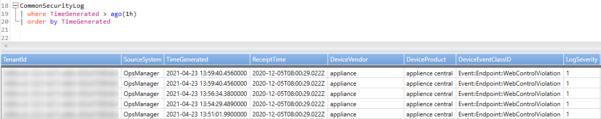

How to collect data to Azure Sentinel using Syslog Server (RSyslog)
===================================================================

Table of Contents
=================

1. [Introduction](https://github.com/Welasco/AzureSentinelSyslog#1-introduction)
1. [What is Syslog?](https://github.com/Welasco/AzureSentinelSyslog#2-what-is-syslog)
1. [What is Log Analytics Agent](https://github.com/Welasco/AzureSentinelSyslog#3-what-is-log-analytics-agent)
1. [Setup Log Analytics agent on Linux (log forward)](https://github.com/Welasco/AzureSentinelSyslog#4-setup-log-analytics-agent-on-linux-log-forward)
1. [Configuring RSyslog to receive messages from Network](https://github.com/Welasco/AzureSentinelSyslog#5-configuring-rsyslog-to-receive-messages-from-network)
1. [Log Analytics agent (OMSAgent) and FluentD](https://github.com/Welasco/AzureSentinelSyslog#6-log-analytics-agent-omsagent-and-fluentd)
1. [Configuring RSyslog and Log Analytics agent to forward Common Event Format (CEF) messages](https://github.com/Welasco/AzureSentinelSyslog#7-configuring-rsyslog-and-log-analytics-agent-to-forward--common-event-format-cef-messages)
1. [Troubleshooting](https://github.com/Welasco/AzureSentinelSyslog#8-troubleshooting)

## 1. Introduction

Azure Sentinel can be connected via an agent to any other data source that can perform real-time log streaming using the Syslog protocol. 

Most appliances use the Syslog protocol to send event messages that include the log itself and data about the log. The format of the logs varies, but most appliances support CEF-based formatting for log data.

The Azure Sentinel agent, which is actually the Log Analytics agent, converts CEF-formatted logs into a format that can be ingested by Log Analytics. Depending on the appliance type, the agent is installed either directly on the appliance, or on a dedicated Linux-based log forwarder. The agent for Linux receives events from the Syslog daemon over UDP, but if a Linux machine is expected to collect a high volume of Syslog events, they are sent over TCP from the Syslog daemon to the agent and from there to Log Analytics.

Here is a diagram of how it works:

You can host the Syslog forwarder server either On-Prem or in Azure VM:

- On-Prem with Log Analytics agent installed:
    

- Azure VM with Log Analytics agent installed:
    

## 2. What is Syslog?

Syslog stands for System Logging Protocol and is a standard protocol used to send system log or event messages to a specific server, called a syslog server. It is primarily used to collect various device logs from several different machines in a central location for monitoring and review.

Syslog is defined in RFC 5424, The Syslog Protocol, which obsoleted the previous RFC 3164:

 - [The Syslog Protocol - RFC5424](https://datatracker.ietf.org/doc/rfc5424/)
 - [The Syslog Protocol - **obsolete** RFC3164](https://datatracker.ietf.org/doc/rfc3164/)

Currently Syslog has two main implementations RSyslog and Syslog-NG.
 - Syslog-NG (1998)
 - RSyslog (2004)

This article will be based in RSyslog.

### Facility

In short, a facility level is used to determine the program or part of the system that produced the logs.
By default, some parts of your system are given facility levels such as the kernel using the kern facility, or your mailing system using the mail facility.
If a third-party wants to issue a log, it would probably a reserved set of facility levels from 16 to 23 called “local use” facility levels.
Alternatively, they can use the “user-level” facility, meaning that they would issue logs related to the user that issued the commands.

| **Facility Number** | **Keyword** | **Facility Description** |
| --- | --- | --- |
| 0 | kern | kernel messages |
| 1 | user | user-level messages |
| 2 | mail | mail system |
| 3 | daemon | system daemons |
| 4 | auth | security/authorization messages |
| 5 | syslog | messages generated internally by syslogd |
| 6 | lpr | line printer subsystem |
| 7 | news | network news subsystem |
| 8 | uucp | UUCP subsystem |
| 9 | cron | clock daemon |
| 10 | authpriv | security/authorization messages |
| 11 |  | FTP daemon |
| 12 |  | NTP subsystem |
| 13 |  | log audit |
| 14 |  | log alert |
| 15 |  | clock daemon (note 2) |
| 16 | local0 | local use 0  (local0) |
| 17 | local1 | local use 1  (local1) |
| 18 | local2 | local use 2  (local2) |
| 19 | local3 | local use 3  (local3) |
| 20 | local4 | local use 4  (local4) |
| 21 | local5 | local use 5  (local5) |
| 22 | local6 | local use 6  (local6) |
| 23 | local7 | local use 7  (local7) |

### Severity

The Severity is one of the following keywords, in ascending order: debug, info, notice, warning, warn
(same as warning), err, error (same as err), crit, alert, emerg, panic (same as emerg).

| **Numerical Code** | **Keyword** | **Severity Description** |
| --- | --- | --- |
| 0 | emerg | Emergency: system is unusable |
| 1 | alert | Alert: action must be taken immediately |
| 2 | crit | Critical: critical conditions |
| 3 | err | Error: error conditions |
| 4 | warning | Warning: warning conditions |
| 5 | notice | Notice: normal but significant condition |
| 6 | info | Informational: informational messages |
| 7 | debug | Debug: debug-level messages |

### Syslog message format

The two values are combined to produce a Priority Value sent with the message. The Priority Value is calculated by multiplying the Facility value by eight and then adding the Severity Value to the result. The lower the PRI, the higher the priority.

```
(Facility Value * 8) + Severity Value = PRI
```

In this way, a kernel message receives lower value (higher priority) than a log alert, regardless of the severity of the log alert. Additional identifiers in the packet include the hostname, IP address, process ID, app name, and timestamp of the message.
The actual verbiage or content of the syslog message is not defined by the protocol. Some messages are simple, readable text, others may only be machine readable.
```
Facility syslog (5), Severity alert (1)
Msg: 1 2021-04-19T15:00:22.303078+00:00 CentOSClient node 444969 123 [timeQuality tzKnown="1" isSynced="1" syncAccuracy="1513"] node test msg

<41>1.2021-04-19T15:00:22.303078+00:00.CentOSClient.node.444969.123.[timeQuality.tzKnown="1".isSynced="1".syncAccuracy="1513"].node.test.msg
```

| **Part** | **Value** | **Information** |
| --- | --- | --- |
PRI | 41 | (5*8)=40 Syslog, 1 = Alert |
VERSION | 1 | Version 1 |
TIMESTAMP | 2021-04-19T15:00:22.303078+00:00 | Message created on Apr, 19, 2021 at 15:00:22, 3 milliseconds into the next second |
HOSTNAME | CentOSClient | Message originated from host 'CentOSClient' |
APP-NAME | node | App Name: node |
PROCID | 444969 | Process ID: 444969 |
MSGID | 123 | Message-ID: 123 |
STRUCTURED-DATA | [timeQuality tzKnown="1" isSynced="1" syncAccuracy="1513"] | Structured Data Element with a non-IANA controlled with 3 parameters timeQuality.tzKnown="1" isSynced="1" syncAccuracy="1513" |
MSG | node test msg | Log message: node test msg |

### Syslog files

Syslog messages can be saved in a file or forwarded to any other system. Using the configuration file you can define where the data should be saved or forwarded using Syslog facilities and severity.

In the following example we are logging anything (expcept mail, authpriv or cron) of level (severity) info or higher to /var/log/messages:

```
*.info;mail.none;authpriv.none;cron.none                /var/log/messages
```

For complete list please review the official [RSyslog documentation](http://www.rsyslog.com/).


## 3. What is Log Analytics Agent

Azure Log Analytics relies on agents to collect data to a Log Analytics Workspace. Azure Sentinel will use the data in a Log Analytics workspace to work with.

The Azure Sentinel agent, which is actually the Log Analytics agent, converts CEF-formatted logs into a format that can be ingested by Log Analytics. The data can also be a regular Syslog message format.

There are many ways in how you can install Log Analytics Agent (OMSAgent):

- **Azure Portal**
    - You can install (connect) from a Log Analytics Workspace to an Azure VM using using connect option:
    
    - You can setup Azure Security Center to set a default Workspace to install the agent in all VMs in a subscription:
    
    - You can deploy at scale using Azure Policy:
    [Deploy Azure Monitor at scale using Azure Policy](https://docs.microsoft.com/en-us/azure/azure-monitor/deploy-scale#log-analytics-agent)
    - All those options will use a Azure VM Extension to install and setup the agent:
    

    > **Note**: In case you have a Azure Policy or Azure Security Center installation option enabled and you want to install the Log Analytics Agent Manually (Using wrapper script or from downloaded files) you have to first isolate (disable the policy) to the target server and make sure there are no Log Analytics agent (OMSAgent) extension installed. In case it was already installed from Azure VM extension you to uninstall it first.

- **Manual installation**
    - Install the agent using wrapper script:
    
        To configure the Linux computer to connect to a Log Analytics workspace, run the following command providing the workspace ID and primary key. The following command downloads the agent, validates its checksum, and installs it.
        ```
        wget https://raw.githubusercontent.com/Microsoft/OMS-Agent-for-Linux/master/installer/scripts/onboard_agent.sh && sh onboard_agent.sh -w <YOUR WORKSPACE ID> -s <YOUR WORKSPACE PRIMARY KEY>
        ```

        The following command includes the `-p` proxy parameter and example syntax when authentication is required by your proxy server:

        ```
        wget https://raw.githubusercontent.com/Microsoft/OMS-Agent-for-Linux/master/installer/scripts/onboard_agent.sh && sh onboard_agent.sh -p [protocol://]<proxy user>:<proxy password>@<proxyhost>[:port] -w <YOUR WORKSPACE ID> -s <YOUR WORKSPACE PRIMARY KEY>
        ```
        Reference: [Install the agent using wrapper script](https://docs.microsoft.com/en-us/azure/azure-monitor/agents/agent-linux#install-the-agent-using-wrapper-script)

    - Install the agent manually

        The Log Analytics agent for Linux is provided in a self-extracting and installable shell script bundle. This bundle contains Debian and RPM packages for each of the agent components and can be installed directly or extracted to retrieve the individual packages. One bundle is provided for x64 and one for x86 architectures. 

        > **Note:** For Azure VMs, we recommend you install the agent on them using the [Azure Log Analytics VM extension](https://docs.microsoft.com/en-us/azure/virtual-machines/extensions/oms-linux) for Linux. 

        1. [Download](https://github.com/microsoft/OMS-Agent-for-Linux#azure-install-guide) and transfer the appropriate bundle (x64 or x86) to your Linux VM or physical computer, using scp/sftp.

        2. Install the bundle by using the `--install` argument. To onboard to a Log Analytics workspace during installation, provide the `-w <WorkspaceID>` and `-s <workspaceKey>` parameters copied earlier.

            >**Note:** You need to use the `--upgrade` argument if any dependent packages such as omi, scx, omsconfig or their older versions are installed, as would be the case if the system Center Operations Manager agent for Linux is already installed. 

            ```
            sudo sh ./omsagent-*.universal.x64.sh --install -w <workspace id> -s <shared key>
            ```

        3. To configure the Linux agent to install and connect to a Log Analytics workspace through a Log Analytics gateway, run the following command providing the proxy, workspace ID, and workspace key parameters. This configuration can be specified on the command line by including `-p [protocol://][user:password@]proxyhost[:port]`. The *proxyhost* property accepts a fully qualified domain name or IP address of the Log Analytics gateway server.  

            ```
            sudo sh ./omsagent-*.universal.x64.sh --upgrade -p https://<proxy address>:<proxy port> -w <workspace id> -s <shared key>
            ```

            If authentication is required, you need to specify the username and password. For example: 
            
            ```
            sudo sh ./omsagent-*.universal.x64.sh --upgrade -p https://<proxy user>:<proxy password>@<proxy address>:<proxy port> -w <workspace id> -s <shared key>
            ```

        4. To configure the Linux computer to connect to a Log Analytics workspace in Azure Government cloud, run the following command providing the workspace ID and primary key copied earlier.

            ```
            sudo sh ./omsagent-*.universal.x64.sh --upgrade -w <workspace id> -s <shared key> -d opinsights.azure.us
            ```

        If you want to install the agent packages and configure it to report to a specific Log Analytics workspace at a later time, run the following command:

        ```
        sudo sh ./omsagent-*.universal.x64.sh --upgrade
        ```

        If you want to extract the agent packages from the bundle without installing the agent, run the following command:

        ```
        sudo sh ./omsagent-*.universal.x64.sh --extract
        ```
        Reference: [Install the agent manually](https://docs.microsoft.com/en-us/azure/azure-monitor/agents/agent-linux#install-the-agent-manually)

## 4. Setup Log Analytics agent on Linux (log forward)

Before setup the Log Analytics agent you must first setup the Agents configuration under the Log Analytics workspace. All the changes under this section in a Log Analytics workspace will be synced to the Log Analytics agent (OMSAgent).

You can check how it stay in sync by checking crontab settings:

```
[victor@doccentos ~]$ cat /etc/cron.d/OMSConsistencyInvoker
5,20,35,50 * * * * omsagent /opt/omi/bin/OMSConsistencyInvoker >/dev/null 2>&1
[victor@doccentos ~]$
```

> Note: By default the sync will happen on every 15 minutes in a random start minute.

Go to the desired Log Analytics workspace and enable all the desired facilities:


In case you have enabled all facilities with all log levels under agent configuration a RSyslog conf file will be created as follow:

```
[victor@doccentos rsyslog.d]$ cat /etc/rsyslog.d/95-omsagent.conf

# OMS Syslog collection for workspace 0a99cce5-22c5-4a75-a66d-403a47090db8
auth.=alert;auth.=crit;auth.=debug;auth.=emerg;auth.=err;auth.=info;auth.=notice;auth.=warning  @127.0.0.1:25224
authpriv.=alert;authpriv.=crit;authpriv.=debug;authpriv.=emerg;authpriv.=err;authpriv.=info;authpriv.=notice;authpriv.=warning        @127.0.0.1:25224
cron.=alert;cron.=crit;cron.=debug;cron.=emerg;cron.=err;cron.=info;cron.=notice;cron.=warning  @127.0.0.1:25224
daemon.=alert;daemon.=crit;daemon.=debug;daemon.=emerg;daemon.=err;daemon.=info;daemon.=notice;daemon.=warning        @127.0.0.1:25224
kern.=alert;kern.=crit;kern.=debug;kern.=emerg;kern.=err;kern.=info;kern.=notice;kern.=warning  @127.0.0.1:25224
local0.=alert;local0.=crit;local0.=debug;local0.=emerg;local0.=err;local0.=info;local0.=notice;local0.=warning        @127.0.0.1:25224
local1.=alert;local1.=crit;local1.=debug;local1.=emerg;local1.=err;local1.=info;local1.=notice;local1.=warning        @127.0.0.1:25224
local2.=alert;local2.=crit;local2.=debug;local2.=emerg;local2.=err;local2.=info;local2.=notice;local2.=warning        @127.0.0.1:25224
local3.=alert;local3.=crit;local3.=debug;local3.=emerg;local3.=err;local3.=info;local3.=notice;local3.=warning        @127.0.0.1:25224
local4.=alert;local4.=crit;local4.=debug;local4.=emerg;local4.=err;local4.=info;local4.=notice;local4.=warning        @127.0.0.1:25224
local5.=alert;local5.=crit;local5.=debug;local5.=emerg;local5.=err;local5.=info;local5.=notice;local5.=warning        @127.0.0.1:25224
local6.=alert;local6.=crit;local6.=debug;local6.=emerg;local6.=err;local6.=info;local6.=notice;local6.=warning        @127.0.0.1:25224
local7.=alert;local7.=crit;local7.=debug;local7.=emerg;local7.=err;local7.=info;local7.=notice;local7.=warning        @127.0.0.1:25224
mail.=alert;mail.=crit;mail.=debug;mail.=emerg;mail.=err;mail.=info;mail.=notice;mail.=warning  @127.0.0.1:25224
syslog.=alert;syslog.=crit;syslog.=debug;syslog.=emerg;syslog.=err;syslog.=info;syslog.=notice;syslog.=warning        @127.0.0.1:25224
user.=alert;user.=crit;user.=debug;user.=emerg;user.=err;user.=info;user.=notice;user.=warning  @127.0.0.1:25224
[victor@doccentos rsyslog.d]$
```

This configuration file is setting up RSyslog to forward all the selected facilities and log levels to Log Analytics agent (OMSAgent) running in localhost under the port UDP 25224.

>Note: There are some advanced scenarios where Log Analytics Agent (OMSAgent) sync should be stopped to avoid configuration conflicts. You can do it using the following command:

```
sudo su omsagent -c 'python /opt/microsoft/omsconfig/Scripts/OMS_MetaConfigHelper.py --disable'
```

> Note: In RSyslog config file a single @ means UDP double @@ means TCP.


By default Log Analytics agent will collect any syslog message (from the facilities and log levels selected in the Azure Portal) and inject the data in a Log analytics workspace. There is no need to change any setting to make the data from the local server to be injected in a Log Analytics workspace.

At this point you have all you need to collect local Linux Syslog messages from all selected facilities and log levels to Azure Log Analytics Workspace using Log Analytics agent (OMSAgent) and Syslog.

To test that everything is working as expected you can basically use the command logger from a Linux terminal:

```
logger "Test log from Linux Logger"
```

You can check the message in Log Analytics workspace using the following query:

```
Syslog 
| where TimeGenerated > ago(1h)
| where SyslogMessage contains "Test log from Linux Logger"
| order by TimeGenerated
```


## 5. Configuring RSyslog to receive messages from Network

By default RSyslog doesn't listen to any TCP/UDP port. To make a Syslog Server become a forwarder server you must load a TCP or UDP module (or both). Here is the changes you must do at /etc/rsyslog.conf to make RSyslog start listening in both 514 TCP and UDP:

```
# Load UDP module
module(load="imudp")
input(type="imudp" port="514")

# Load TCP module
module(load="imtcp")
input(type="imtcp" port="514")
```

These entries must be added (or uncomment) near to the beginning of the config file /etc/rsyslog.conf. Example:

```
# /etc/rsyslog.conf configuration file for rsyslog
#
# For more information install rsyslog-doc and see
# /usr/share/doc/rsyslog-doc/html/configuration/index.html
#
# Default logging rules can be found in /etc/rsyslog.d/50-default.conf


#################
#### MODULES ####
#################

module(load="imuxsock") # provides support for local system logging
#module(load="immark")  # provides --MARK-- message capability

# provides UDP syslog reception
module(load="imudp")
input(type="imudp" port="514")

# provides TCP syslog reception
module(load="imtcp")
input(type="imtcp" port="514")

# provides kernel logging support and enable non-kernel klog messages
module(load="imklog" permitnonkernelfacility="on")

###########################
#### GLOBAL DIRECTIVES ####
###########################
...
```

In order for these changes take effect you have to restart RSyslog daemon using the following command:

```
sudo systemctl restart rsyslog
sudo systemctl status rsyslog
```

You can check if your server are receiving messages remote messages using the logger command specifying to send a message to a remote server. From any remote Linux type the following command replacing the IP Address to your Syslog Forwarder server IP:

```
logger -n 10.0.5.8 -i --msgid "123" "Test log from remote Linux Logger"
```

Depending on your Linux distribution all Syslog messages will be saved under /var/log/messages (Red-Hat based distributions) or /var/log/syslog (Debian based distributions). You can also check the content of this file to see if you are receiving remote messages using the following command:

```
tail -f /var/log/messages
```

> Note: To conform where your Linux distribution is saving the Syslog messages check the configuration file /etc/rsyslog.conf

You can check the message in Log Analytics workspace using the following query:

```
Syslog 
| where TimeGenerated > ago(1h)
| where SyslogMessage contains "Test log from remote Linux Logger"
| order by TimeGenerated
```

At this point you have a full functioning Linux RSyslog forwarder server. It's able to receive remote data from network under TCP/UDP 514 port and forward to Log Analytics agent (OMSAgent) under UDP 25224. You can confirm the forward configuration by checking the file that was created by Log Analytics agent (OMSAgent) used to setup RSyslog "/etc/rsyslog.d/95-omsagent.conf".

## 6. Log Analytics agent (OMSAgent) and FluentD

The [Log Analytics Agent (OMSAgent)](https://github.com/Microsoft/OMS-Agent-for-Linux) is based on [FluentD](https://docs.fluentd.org/). Fluentd is an open-source data collector for a unified logging layer. Fluentd allows you to unify data collection and consumption for better use and understanding of data.

FluentD has a concept of plugins like Input Plugins, Output Plugins, Filter Plugins, Parser Plugins, Formatter Plugins and many others.

- Input Plugins, uses a source block to specify a plugin to be used and all the specifics about it. There are many Input Plugins available you can check them [here](https://docs.fluentd.org/input):
    ```
    <source>
        @type syslog
        port 5140
        bind 0.0.0.0
        tag syslog-data
    </source>
    ```
- Output Plugins, uses a match block which will use the tag from the Input Plugin (source block) to define what to do with the data. There are also many Output Plugins available you can check them [here](https://docs.fluentd.org/output).
    ```
    <match syslog-data>
        @type file
        path /var/log/fluent/myapp
        compress gzip
        <buffer>
            timekey 1d
            timekey_use_utc true
            timekey_wait 10m
        </buffer>
    </match>
    ```
The main purpose for those plugins are to make FluentD extremely customizable. You can also write your own plugin to for example export the data to a specific database.

With this concept in mind that's how Log Analytics agent (OMSAgent) leverage from FluentD to receive logs (Input Plugin) and forward them to Log Analytics workspace (Output Plugin).

For a full understand about FluentD check the [official documentation](https://docs.fluentd.org/).

## 7. Configuring RSyslog and Log Analytics agent to forward  Common Event Format (CEF) messages

- **Log Analytics agent (OMSAgent)**

    To configure the Log Analytics agent (OMSAgent) for CEF is necessary to create a new configuration file  with the following content:

    ```
    <source>
        type syslog
        port 25226
        bind 127.0.0.1
        protocol_type tcp
        tag oms.security
        format /(?<time>(?:\w+ +){2,3}(?:\d+:){2}\d+|\d{4}-\d{2}-\d{2}T\d{2}:\d{2}:\d{2}.[\w\-\:\+]{3,12}):?\s*(?:(?<host>[^: ]+) ?:?)?\s*(?<ident>.*CEF.+?(?=0\|)|%ASA[0-9\-]{8,10})\s*:?(?<message>0\|.*|.*)/
        <parse>
            message_format auto
        </parse>
    </source>

    <filter oms.security.**>
        type filter_syslog_security
    </filter>
    ```

    This file must be saved using the following path:

    ```
    /etc/opt/microsoft/omsagent/[workspaceID]/conf/omsagent.d/security_events.conf
    ```

    > **Note:** Replace [workspaceID] with the desired Log Analytics workspace ID.

    You can also achieve using the following command line which will copy the entire file from it source:

    ```
    wget -O /etc/opt/microsoft/omsagent/[workspaceID]/conf/omsagent.d/security_events.conf https://raw.githubusercontent.com/microsoft/OMS-Agent-for-Linux/master/installer/conf/omsagent.d/security_events.conf
    ```
    > **Note:** Replace [workspaceID] with the desired Log Analytics workspace ID.

    This file is configuring Log Analytics agent (OMSAgent) using a FluentD Input Plugin. It's based in [syslog Input Plugin](https:/docs.fluentd.org/input/syslog) and it's been configured as follow:
        
    - Listen on TCP port 25226 and binding to localhost onlye "127.0.0.1"
    - Tag all input data with "oms.security" tag
    - Format the data using format section to CEF/ASA with a regular expression

    It's also filtering the data using a special filter named filter_syslog_security. For a deeper understanding you can access this filter at:

    ```
    /opt/microsoft/omsagent/plugin/filter_syslog_security.rb
    ```

    > **Note:** FluentD is written in Ruby. You can open most of the plugins using any text editor.

    For any Input Plugin there must be an Output Plugin. It means if you would like to check how the collected data gets injected in Log Analytics Workspace you can find the matching Output Plugin opening the main config file at:

    ```
    /etc/opt/microsoft/omsagent/[workspaceID]/conf/omsagent.conf
    ```

    You will find this matching Output Plugin:

    ```
    <match oms.** docker.**>
        type out_oms
        log_level info
        num_threads 5
        run_in_background false

        omsadmin_conf_path /etc/opt/microsoft/omsagent/0a99cce5-22c5-4a75-a66d-403a47090db8/conf/omsadmin.c$  cert_path /etc/opt/microsoft/omsagent/0a99cce5-22c5-4a75-a66d-403a47090db8/certs/oms.crt
        key_path /etc/opt/microsoft/omsagent/0a99cce5-22c5-4a75-a66d-403a47090db8/certs/oms.key

        buffer_chunk_limit 15m
        buffer_type file
        buffer_path /var/opt/microsoft/omsagent/0a99cce5-22c5-4a75-a66d-403a47090db8/state/out_oms_common*.$

        buffer_queue_limit 10
        buffer_queue_full_action drop_oldest_chunk
        flush_interval 20s
        retry_limit 6
        retry_wait 30s
        max_retry_wait 30m
    </match>
    ```

    This is a special Output Plugin named out_oms. For a deeper understanding you can access this Output Plugin at:

    ```
    /opt/microsoft/omsagent/plugin/out_oms.rb
    ```

    All CEF messages will be sent to **CommonSecurityLog** table under the Log Analytics wokspace.

    At this point after save the configuration file you have Log Analytics agent (OMSAgent) listening on TCP port 25226 waiting to receive data from RSyslog.
    
- **RSyslog**

    To configure the RSyslog to start forwarding CEF/ASA messages to Log Analytics agent (TCP 25226) is necessary to create a new configuration file  with the following content:

    ```
    if $rawmsg contains "CEF:" or $rawmsg contains "ASA-" then @@127.0.0.1:25226
    ```

    This file must be saved using the following path:

    ```
    /etc/rsyslog.d/security-config-omsagent.conf
    ```
    This configuration file is checking the content of the syslog message. If it contains "CEF:" or "ASA-" it will forward the data to 127.0.0.1:25226 TCP.

    In order for these changes take effect you have to restart RSyslog daemon and Log Analytics agent (OMSAgent) using the following command:

    ```
    sudo systemctl restart omsagent-[workspaceID].service
    sudo systemctl status omsagent-[workspaceID].service

    sudo systemctl restart rsyslog
    sudo systemctl status rsyslog
    ```

    To test if all CEF messages are going to the write table you can send a sample massage using the following command:

    ```
    logger -p local4.warn -t CEF: "0|appliance|applience central|1.0|Event::Endpoint::WebControlViolation|User bypassed category block to 'https://azeus1-client-s.gateway.messenger.live.com'|1|source_info_ip=192.168.1.7 rt=2020-12-05T08:00:29.022Z end=2020-12-05T07:55:26.000Z duid=5a5cef08b8bcb912fbaede04 endpoint_type=computer endpoint_id=46240012-53fd-437f-96e2-026144bc2012 suser=Test, User group=WEB_Users customer_id=a7ca6904-570d-49de-9252-f6190d32eef3 id=1641dc5d-a4bf-4a10-99d6-2762dd008451 dhost=luti-test11" -P 514 -n 127.0.0.1    
    ```

    You can check the message in Log Analytics workspace using the following query:

    ```
    CommonSecurityLog 
    | where TimeGenerated > ago(1h)
    | order by TimeGenerated
    ```

    

    At this point you have configured the RSyslog to forward all CEF messages to Log Analytics agent under a special filter that are listening under the port 25226 TCP. Any other syslog message will be forwarded to Log Analytics agent under the standard oms.syslog syslog filter using the port 25224 UDP.

    You can see how the standard syslog messages gets filtered, parsed and sended to Log Analytics workspace by checking the following files:

    ```
    /etc/opt/microsoft/omsagent/[workspaceID]/conf/omsagent.d/syslog.conf
    /opt/microsoft/omsagent/plugin/filter_syslog.rb
    /opt/microsoft/omsagent/plugin/out_oms.rb
    ``` 

## 8. Troubleshooting

Before we start digging into troubleshooting it's important to recap how RSyslog and Log Analytics agent are playing together.

RSyslog will be listening on port 514 TCP/UDP to receive remote syslog messages. All those messages will be saved under one of those two files depending on your Linux distribution:

```
/var/log/messages (Red-Hat based distributions)
/var/log/syslog (Debian based distributions)
```

After the message is received RSyslog will forward the message to Log Analytics agent (OMSAgent) using the port 24224 UDP.

Before going deep in troubleshooting is always a good to start from the basics reviewing all the configuration files.

 - **Network Troubleshooting**

    The first part of the troubleshooting would be a confirmation the server is receiving data by checking log files or network trace.

    You can check if all the services are listening in the right port by running the following command:

    ```
    [root@CentOSSyslog omsagent.d]# netstat -nap | grep 25
    udp        0      0 127.0.0.1:25224         0.0.0.0:*                           438229/ruby
    tcp        0      0 127.0.0.1:25226         0.0.0.0:*               LISTEN      438229/ruby
    ```

    To send a syslog message to a remote server you can use the command logger:

    ```
    logger -n 10.0.5.4 -i --msgid "123" "test message"
    ```

    There are some scenarios where you would like to troubleshoot the format of a syslog message. For those type of scenarios you can use the command nc (Netcat):

    ```
    echo -n '<14>1 2021-02-10T16:36:59.945-05:00 msft-fw RT_FLOW - APPTRACK_SESSION_VOL_UPDATE [vws12@2636.1.1.1.2.105 source-address="192.168.0.1" source-port="59000" destination-address="13.0.0.9" destination-port="443" service-name="junos-https" application="SSL" nested-application="SHAREPOINT-ONLINE" nat-source-address="64.0.0.5" nat-source-port="33680" nat-destination-address="13.0.0.9" nat-destination-port="443" src-nat-rule-name="rule-27" dst-nat-rule-name="N/A" protocol-id="6" policy-name="VWSA-INTERNET-ACCESS" source-zone-name="TRUST" destination-zone-name="UNTRUST" session-id-32="35684215" packets-from-client="9" bytes-from-client="3045" packets-from-server="12" bytes-from-server="6664" elapsed-time="66" username="N/A" roles="N/A" encrypted="No1asdf"]' | nc -4u -w1 10.0.5.4
    514
    ```

    To live check the log files in RSyslog you can use the following command:

    ```
    tail -f /var/log/messages | grep "[message filter]"
    ```

    > ***Note:*** Replace [message filter] to a peace of the message you are looking for.

    To live check the network packets you can use the following command:

    ```
    sudo tcpdump -i eth0 -Xvv port 514 and src 10.0.5.5
    ```

    > **Note:** This command is capturing all network traffic on port 514 and source IP address 10.0.5.5. It will dump the captured information in the screen.

    The next part is to check if RSyslog is forwarding the messages to Log Analytics agent (OMSAgent) under the port 25224 using local network capture using the following command tcpdump command:

    ```
    sudo tcpdump -i lo -Xvv port 25224
    ```

    In case the problem you are troubleshooting is related to CEF messages you can use the following command defining the port 25226:

    ```
    sudo tcpdump -i lo -nnvvXS port 25226
    ```

- **SELinux**

    Security-Enhanced Linux (SELinux) is a security architecture for Linux® systems that allows administrators to have more control over who can access the system.

    SELinux defines access controls for the applications, processes, and files on a system. It uses security policies, which are a set of rules that tell SELinux what can or can’t be accessed, to enforce the access allowed by a policy.

    SELinux can block access to any file or socket.

    SELinux is not support with Log Analytics agent (OMSAgent).

    In case you get blocked by SELinux you will see a similar messages under the log file in the first access to Log Analytics agent (OMSAgent) port:

    ```
    [root@doccentos victor]# tail -f /var/log/audit/audit.log
    type=AVC msg=audit(1619045288.713:119): avc:  denied  { name_connect } for  pid=1133 comm=72733A6D61696E20513A526567 dest=25226 scontext=system_u:system_r:syslogd_t:s0 tcontext=system_u:object_r:unreserved_port_t:s0 tclass=tcp_socket permissive=0
    type=SYSCALL msg=audit(1619045288.713:119): arch=c000003e syscall=42 success=no exit=-13 a0=18 a1=7f6268006f70 a2=10 a3=5 items=0 ppid=1 pid=1133 auid=4294967295 uid=0 gid=0 euid=0 suid=0 fsuid=0 egid=0 sgid=0 fsgid=0 tty=(none) ses=4294967295 comm=72733A6D61696E20513A526567 exe="/usr/sbin/rsyslogd" subj=system_u:system_r:syslogd_t:s0 key=(null)
    type=PROCTITLE msg=audit(1619045288.713:119): proctitle=2F7573722F7362696E2F727379736C6F6764002D6E
    type=AVC msg=audit(1619045288.714:120): avc:  denied  { name_connect } for  pid=1133 comm=72733A6D61696E20513A526567 dest=25226 scontext=system_u:system_r:syslogd_t:s0 tcontext=system_u:object_r:unreserved_port_t:s0 tclass=tcp_socket permissive=0
    type=SYSCALL msg=audit(1619045288.714:120): arch=c000003e syscall=42 success=no exit=-13 a0=18 a1=7f6268006f70 a2=10 a3=0 items=0 ppid=1 pid=1133 auid=4294967295 uid=0 gid=0 euid=0 suid=0 fsuid=0 egid=0 sgid=0 fsgid=0 tty=(none) ses=4294967295 comm=72733A6D61696E20513A526567 exe="/usr/sbin/rsyslogd" subj=system_u:system_r:syslogd_t:s0 key=(null)
    type=PROCTITLE msg=audit(1619045288.714:120): proctitle=2F7573722F7362696E2F727379736C6F6764002D6E
    type=AVC msg=audit(1619045288.714:121): avc:  denied  { name_connect } for  pid=1133 comm=72733A6D61696E20513A526567 dest=25226 scontext=system_u:system_r:syslogd_t:s0 tcontext=system_u:object_r:unreserved_port_t:s0 tclass=tcp_socket permissive=0
    type=SYSCALL msg=audit(1619045288.714:121): arch=c000003e syscall=42 success=no exit=-13 a0=18 a1=7f626804e840 a2=10 a3=5 items=0 ppid=1 pid=1133 auid=4294967295 uid=0 gid=0 euid=0 suid=0 fsuid=0 egid=0 sgid=0 fsgid=0 tty=(none) ses=4294967295 comm=72733A6D61696E20513A526567 exe="/usr/sbin/rsyslogd" subj=system_u:system_r:syslogd_t:s0 key=(null)
    type=PROCTITLE msg=audit(1619045288.714:121): proctitle=2F7573722F7362696E2F727379736C6F6764002D6E
    type=AVC msg=audit(1619045288.714:122): avc:  denied  { name_connect } for  pid=1133 comm=72733A6D61696E20513A526567 dest=25226 scontext=system_u:system_r:syslogd_t:s0 tcontext=system_u:object_r:unreserved_port_t:s0 tclass=tcp_socket permissive=0
    type=SYSCALL msg=audit(1619045288.714:122): arch=c000003e syscall=42 success=no exit=-13 a0=18 a1=7f626804e840 a2=10 a3=0 items=0 ppid=1 pid=1133 auid=4294967295 uid=0 gid=0 euid=0 suid=0 fsuid=0 egid=0 sgid=0 fsgid=0 tty=(none) ses=4294967295 comm=72733A6D61696E20513A526567 exe="/usr/sbin/rsyslogd" subj=system_u:system_r:syslogd_t:s0 key=(null)
    type=PROCTITLE msg=audit(1619045288.714:122): proctitle=2F7573722F7362696E2F727379736C6F6764002D6E
    ```

    ```
    [victor@doccentos ~]$ sudo tail -f /var/log/messages
    Apr 21 22:48:08 doccentos rsyslogd: action 'action 17' suspended, next retry is Wed Apr 21 22:48:38 2021 [v8.24.0-57.el7_9 try http://www.rsyslog.com/e/2007 ]    
    ```

    SELinux is anabled by default on any RedHat based Linux distrubution.

    To check the status of SELinux you use the following command:

    ```
    [root@doccentos victor]# sestatus
    SELinux status:                 enabled
    SELinuxfs mount:                /sys/fs/selinux
    SELinux root directory:         /etc/selinux
    Loaded policy name:             targeted
    Current mode:                   enforcing
    Mode from config file:          enforcing
    Policy MLS status:              enabled
    Policy deny_unknown status:     allowed
    Max kernel policy version:      31
    ```

    To temporarily disable SELinux you can use the following command:

    ```
    [root@doccentos victor]# setenforce 0
    [root@doccentos victor]# sestatus
    SELinux status:                 enabled
    SELinuxfs mount:                /sys/fs/selinux
    SELinux root directory:         /etc/selinux
    Loaded policy name:             targeted
    Current mode:                   permissive
    Mode from config file:          enforcing
    Policy MLS status:              enabled
    Policy deny_unknown status:     allowed
    Max kernel policy version:      31
    ```

    To permanently disable SELinux change the configuration file /etc/sysconfig/selinux as follow:

    ```
    From:
    SELINUX=enforcing

    To:
    SELINUX=disabled
    ```

- **Scenario 1: Messages not showing in the log**

    There are some scenarios where you would like to troubleshoot the format of a syslog message. If a syslog message is not formated following the RFCs there is a big chance the message will be trucated in the log. For those type of scenarios you can use the command nc (Netcat):

    ```
    echo -n '<14>1 2021-02-10T16:36:59.945-05:00 msft-fw RT_FLOW - APPTRACK_SESSION_VOL_UPDATE [vws12@2636.1.1.1.2.105 source-address="192.168.0.1" source-port="59000" destination-address="13.0.0.9" destination-port="443" service-name="junos-https" application="SSL" nested-application="SHAREPOINT-ONLINE" nat-source-address="64.0.0.5" nat-source-port="33680" nat-destination-address="13.0.0.9" nat-destination-port="443" src-nat-rule-name="rule-27" dst-nat-rule-name="N/A" protocol-id="6" policy-name="VWSA-INTERNET-ACCESS" source-zone-name="TRUST" destination-zone-name="UNTRUST" session-id-32="35684215" packets-from-client="9" bytes-from-client="3045" packets-from-server="12" bytes-from-server="6664" elapsed-time="66" username="N/A" roles="N/A" encrypted="No1asdf"]' | nc -4u -w1 10.0.5.4
    514
    ```

    This previous example is a good demonstration of how a simple message may not work with syslog. It looks like any regular message but it's a not valid RFC5424 message. If you test this previous command you will see that entire message was received on network but it was truncated in the log.

    Here is the network output of the previous message:

    ```
    [victor@CentOSSyslog ~]$ sudo tcpdump -i eth0 -Xvv port 514 and src 10.0.5.5
    dropped privs to tcpdump
    tcpdump: listening on eth0, link-type EN10MB (Ethernet), capture size 262144 bytes
    21:38:46.456876 IP (tos 0x0, ttl 64, id 7384, offset 0, flags [DF], proto UDP (17), length 786)
        centosclient.internal.cloudapp.net.43903 > centossyslog.internal.cloudapp.net.syslog: [udp sum ok] SYSLOG, length: 758
            Facility user (1), Severity info (6)
            Msg: 1 2021-02-10T16:36:59.945-05:00 msft-fw RT_FLOW - APPTRACK_SESSION_VOL_UPDATE [vws12@2636.1.1.1.2.105 source-address="192.168.0.1" source-port="59000" destination-address="13.0.0.9" destination-port="443" service-name="junos-https" application="SSL" nested-application="SHAREPOINT-ONLINE" nat-source-address="64.0.0.5" nat-source-port="33680" nat-destination-address="13.0.0.9" nat-destination-port="443" src-nat-rule-name="rule-27" dst-nat-rule-name="N/A" protocol-id="6" policy-name="VWSA-INTERNET-ACCESS" source-zone-name="TRUST" destination-zone-name="UNTRUST" session-id-32="35684215" packets-from-client="9" bytes-from-client="3045" packets-from-server="12" bytes-from-server="6664" elapsed-time="66" username="N/A" roles="N/A" encrypted="No1asdf"]
            0x0000:  3c31 343e 3120 3230 3231 2d30 322d 3130
            0x0010:  5431 363a 3336 3a35 392e 3934 352d 3035
            0x0020:  3a30 3020 6d73 6674 2d66 7720 5254 5f46
            0x0030:  4c4f 5720 2d20 4150 5054 5241 434b 5f53
            0x0040:  4553 5349 4f4e 5f56 4f4c 5f55 5044 4154
            0x0050:  4520 5b76 7773 3132 4032 3633 362e 312e
            0x0060:  312e 312e 322e 3130 3520 736f 7572 6365
            0x0070:  2d61 6464 7265 7373 3d22 3139 322e 3136
            0x0080:  382e 302e 3122 2073 6f75 7263 652d 706f
            0x0090:  7274 3d22 3539 3030 3022 2064 6573 7469
            0x00a0:  6e61 7469 6f6e 2d61 6464 7265 7373 3d22
            0x00b0:  3133 2e30 2e30 2e39 2220 6465 7374 696e
            0x00c0:  6174 696f 6e2d 706f 7274 3d22 3434 3322
            0x00d0:  2073 6572 7669 6365 2d6e 616d 653d 226a
            0x00e0:  756e 6f73 2d68 7474 7073 2220 6170 706c
            0x00f0:  6963 6174 696f 6e3d 2253 534c 2220 6e65
            0x0100:  7374 6564 2d61 7070 6c69 6361 7469 6f6e
            0x0110:  3d22 5348 4152 4550 4f49 4e54 2d4f 4e4c
            0x0120:  494e 4522 206e 6174 2d73 6f75 7263 652d
            0x0130:  6164 6472 6573 733d 2236 342e 302e 302e
            0x0140:  3522 206e 6174 2d73 6f75 7263 652d 706f
            0x0150:  7274 3d22 3333 3638 3022 206e 6174 2d64
            0x0160:  6573 7469 6e61 7469 6f6e 2d61 6464 7265
            0x0170:  7373 3d22 3133 2e30 2e30 2e39 2220 6e61
            0x0180:  742d 6465 7374 696e 6174 696f 6e2d 706f
            0x0190:  7274 3d22 3434 3322 2073 7263 2d6e 6174
            0x01a0:  2d72 756c 652d 6e61 6d65 3d22 7275 6c65
            0x01b0:  2d32 3722 2064 7374 2d6e 6174 2d72 756c
            0x01c0:  652d 6e61 6d65 3d22 4e2f 4122 2070 726f
            0x01d0:  746f 636f 6c2d 6964 3d22 3622 2070 6f6c
            0x01e0:  6963 792d 6e61 6d65 3d22 5657 5341 2d49
            0x01f0:  4e54 4552 4e45 542d 4143 4345 5353 2220
            0x0200:  736f 7572 6365 2d7a 6f6e 652d 6e61 6d65
            0x0210:  3d22 5452 5553 5422 2064 6573 7469 6e61
            0x0220:  7469 6f6e 2d7a 6f6e 652d 6e61 6d65 3d22
            0x0230:  554e 5452 5553 5422 2073 6573 7369 6f6e
            0x0240:  2d69 642d 3332 3d22 3335 3638 3432 3135
            0x0250:  2220 7061 636b 6574 732d 6672 6f6d 2d63
            0x0260:  6c69 656e 743d 2239 2220 6279 7465 732d
            0x0270:  6672 6f6d 2d63 6c69 656e 743d 2233 3034
            0x0280:  3522 2070 6163 6b65 7473 2d66 726f 6d2d
            0x0290:  7365 7276 6572 3d22 3132 2220 6279 7465
            0x02a0:  732d 6672 6f6d 2d73 6572 7665 723d 2236
            0x02b0:  3636 3422 2065 6c61 7073 6564 2d74 696d
            0x02c0:  653d 2236 3622 2075 7365 726e 616d 653d
            0x02d0:  224e 2f41 2220 726f 6c65 733d 224e 2f41
            0x02e0:  2220 656e 6372 7970 7465 643d 224e 6f31
            0x02f0:  6173 6466 225d
            0x0000:  4500 0312 1cd8 4000 4011 fcfa 0a00 0505  E.....@.@.......
            0x0010:  0a00 0504 ab7f 0202 02fe 5cbd 3c31 343e  ..........\.<14>
            0x0020:  3120 3230 3231 2d30 322d 3130 5431 363a  1.2021-02-10T16:
            0x0030:  3336 3a35 392e 3934 352d 3035 3a30 3020  36:59.945-05:00.
            0x0040:  6d73 6674 2d66 7720 5254 5f46 4c4f 5720  msft-fw.RT_FLOW.
            0x0050:  2d20 4150 5054 5241 434b 5f53 4553 5349  -.APPTRACK_SESSI
            0x0060:  4f4e 5f56 4f4c 5f55 5044 4154 4520 5b76  ON_VOL_UPDATE.[v
            0x0070:  7773 3132 4032 3633 362e 312e 312e 312e  ws12@2636.1.1.1.
            0x0080:  322e 3130 3520 736f 7572 6365 2d61 6464  2.105.source-add
            0x0090:  7265 7373 3d22 3139 322e 3136 382e 302e  ress="192.168.0.
            0x00a0:  3122 2073 6f75 7263 652d 706f 7274 3d22  1".source-port="
            0x00b0:  3539 3030 3022 2064 6573 7469 6e61 7469  59000".destinati
            0x00c0:  6f6e 2d61 6464 7265 7373 3d22 3133 2e30  on-address="13.0
            0x00d0:  2e30 2e39 2220 6465 7374 696e 6174 696f  .0.9".destinatio
            0x00e0:  6e2d 706f 7274 3d22 3434 3322 2073 6572  n-port="443".ser
            0x00f0:  7669 6365 2d6e 616d 653d 226a 756e 6f73  vice-name="junos
            0x0100:  2d68 7474 7073 2220 6170 706c 6963 6174  -https".applicat
            0x0110:  696f 6e3d 2253 534c 2220 6e65 7374 6564  ion="SSL".nested
            0x0120:  2d61 7070 6c69 6361 7469 6f6e 3d22 5348  -application="SH
            0x0130:  4152 4550 4f49 4e54 2d4f 4e4c 494e 4522  AREPOINT-ONLINE"
            0x0140:  206e 6174 2d73 6f75 7263 652d 6164 6472  .nat-source-addr
            0x0150:  6573 733d 2236 342e 302e 302e 3522 206e  ess="64.0.0.5".n
            0x0160:  6174 2d73 6f75 7263 652d 706f 7274 3d22  at-source-port="
            0x0170:  3333 3638 3022 206e 6174 2d64 6573 7469  33680".nat-desti
            0x0180:  6e61 7469 6f6e 2d61 6464 7265 7373 3d22  nation-address="
            0x0190:  3133 2e30 2e30 2e39 2220 6e61 742d 6465  13.0.0.9".nat-de
            0x01a0:  7374 696e 6174 696f 6e2d 706f 7274 3d22  stination-port="
            0x01b0:  3434 3322 2073 7263 2d6e 6174 2d72 756c  443".src-nat-rul
            0x01c0:  652d 6e61 6d65 3d22 7275 6c65 2d32 3722  e-name="rule-27"
            0x01d0:  2064 7374 2d6e 6174 2d72 756c 652d 6e61  .dst-nat-rule-na
            0x01e0:  6d65 3d22 4e2f 4122 2070 726f 746f 636f  me="N/A".protoco
            0x01f0:  6c2d 6964 3d22 3622 2070 6f6c 6963 792d  l-id="6".policy-
            0x0200:  6e61 6d65 3d22 5657 5341 2d49 4e54 4552  name="VWSA-INTER
            0x0210:  4e45 542d 4143 4345 5353 2220 736f 7572  NET-ACCESS".sour
            0x0220:  6365 2d7a 6f6e 652d 6e61 6d65 3d22 5452  ce-zone-name="TR
            0x0230:  5553 5422 2064 6573 7469 6e61 7469 6f6e  UST".destination
            0x0240:  2d7a 6f6e 652d 6e61 6d65 3d22 554e 5452  -zone-name="UNTR
            0x0250:  5553 5422 2073 6573 7369 6f6e 2d69 642d  UST".session-id-
            0x0260:  3332 3d22 3335 3638 3432 3135 2220 7061  32="35684215".pa
            0x0270:  636b 6574 732d 6672 6f6d 2d63 6c69 656e  ckets-from-clien
            0x0280:  743d 2239 2220 6279 7465 732d 6672 6f6d  t="9".bytes-from
            0x0290:  2d63 6c69 656e 743d 2233 3034 3522 2070  -client="3045".p
            0x02a0:  6163 6b65 7473 2d66 726f 6d2d 7365 7276  ackets-from-serv
            0x02b0:  6572 3d22 3132 2220 6279 7465 732d 6672  er="12".bytes-fr
            0x02c0:  6f6d 2d73 6572 7665 723d 2236 3636 3422  om-server="6664"
            0x02d0:  2065 6c61 7073 6564 2d74 696d 653d 2236  .elapsed-time="6
            0x02e0:  3622 2075 7365 726e 616d 653d 224e 2f41  6".username="N/A
            0x02f0:  2220 726f 6c65 733d 224e 2f41 2220 656e  ".roles="N/A".en
            0x0300:  6372 7970 7465 643d 224e 6f31 6173 6466  crypted="No1asdf
            0x0310:  225d                                     "]
    1 packet captured
    ```

    Here is the log output of the previous message:

    ```
    [root@CentOSSyslog omsagent.d]# tail -f /var/log/messages
    Feb 10 16:36:59 msft-fw RT_FLOW
    ```

    This is a classic scenario where the Log Analytics agent (OMSAgent) would only receive the truncated message. To fix it you have to fix the remote source which is generating (sending the message) to syslog.

- **Scenario 2: Troubleshooting CEF messages**

    CEF messages are parsered in a RSyslog configuration file to check if the content of the message has CEF or ASA. If that's the case the message must be forwarded to a special Log Analytics agent listener with some special filters and output.

    To test if a CEF message is going to the right place you can use this command:

    ```
    logger -p local4.warn -t CEF: "0|appliance|applience central|1.0|Event::Endpoint::WebControlViolation|User bypassed category block to 'https://azeus1-client-s.gateway.messenger.live.com'|1|source_info_ip=192.168.1.7 rt=2020-12-05T08:00:29.022Z end=2020-12-05T07:55:26.000Z duid=5a5cef08b8bcb912fbaede04 endpoint_type=computer endpoint_id=46240012-53fd-437f-96e2-026144bc2012 suser=Test, User group=WEB_Users customer_id=a7ca6904-570d-49de-9252-f6190d32eef3 id=1641dc5d-a4bf-4a10-99d6-2762dd008451 dhost=luti-test11" -P 514 -n 127.0.0.1
    ```

    To make sure this message was forwarded to the right Log Analytics agent (OMSAgent) listener use the following command:

    ```
    sudo tcpdump -i lo -Xvv port 25226
    ```

    You should expect to see a network package going to this listener. In case you don't see anything check the RSyslog config file /etc/rsyslog.d/security-config-omsagent.conf or if SELinux is enabled.

- **Scenario 3: Invalid CEF Message**

    FluentD allows for plugin-specific logging levels allowing you to specify different log levels for inputs and outputs. To specify a different log level for OMS output, edit the general agent configuration at /etc/opt/microsoft/omsagent/<workspace id>/conf/omsagent.conf.

    In case any appliance are sending an invalid CEF message you can catch the problem by increasing the OMS output plugin.

    In the OMS output plugin, before the end of the configuration file, change the log_level property from info to debug:

    ```
    <match oms.** docker.**>
        type out_oms
        log_level debug
        num_threads 5
        buffer_chunk_limit 5m
        buffer_type file
        buffer_path /var/opt/microsoft/omsagent/<workspace id>/state/out_oms*.buffer
        buffer_queue_limit 10
        flush_interval 20s
        retry_limit 10
        retry_wait 30s
    </match>
    ```

    You have to restart the service for the changes take effect using the following command:

    ```
    sudo systemctl restart omsagent-[workspaceID].service
    sudo systemctl status omsagent-[workspaceID].service
    ```

    In case any applience send an invalid massage like the example bellow you will be able to catch the problem checking the Log Analytcs agent (OMSAgent) log.

    Sample of message coming from an appliance that cannot be recognized:

    ```
    echo -n '<14>1 2021-04-19T15:00:22.303078+00:00 msft-fw RT_FLOW 444969 123 [timeQuality tzKnown="1" isSynced="1" syncAccuracy="1513"] CEF:0|appliance|applience central|1.0|Event::Endpoint::WebControlViolation|User bypassed category block to 'https://azeus1-client-s.gateway.messenger.live.com'|1|source_info_ip=192.168.1.7 rt=2020-12-05T08:00:29.022Z end=2020-12-05T07:55:26.000Z duid=5a5cef08b8bcb912fbaede04 endpoint_type=computer endpoint_id=46240012-53fd-437f-96e2-026144bc2012 suser=Test, User group=WEB_Users customer_id=a7ca6904-570d-49de-9252-f6190d32eef3 id=1641dc5d-a4bf-4a10-99d6-2762dd008451 dhost=Host123' | nc -4u -w1 10.0.5.8 514
    ```

    Expected log entries in /var/opt/microsoft/omsagent/log/omsagent.log:

    ```
    2021-04-23 14:24:13 +0000 [error]: Unable to resolve the IP of 'msft-fw': no address for msft-fw
    2021-04-23 14:24:13 +0000 [warn]: Failed to get the IP for msft-fw.
    ```


    The log files are under the following path:

    ```
    /var/opt/microsoft/omsagent/log
    ```

    Instead of using the OMS output plugin you can also output data items directly to stdout, which is visible in the Log Analytics agent for Linux log file.

    In the Log Analytics general agent configuration file at /etc/opt/microsoft/omsagent/<workspace id>/conf/omsagent.conf, comment out the OMS output plugin by adding a # in front of each line:

    ```
    #<match oms.** docker.**>
    #  type out_oms
    #  log_level info
    #  num_threads 5
    #  buffer_chunk_limit 5m
    #  buffer_type file
    #  buffer_path /var/opt/microsoft/omsagent/<workspace id>/state/out_oms*.buffer
    #  buffer_queue_limit 10
    #  flush_interval 20s
    #  retry_limit 10
    #  retry_wait 30s
    #</match>
    ```

    At the end of the configuration file, uncomment the following section by removing the # in front of each line:

    ```
    <match **>
        type stdout
    </match>
    ```

    ### This is for reference only probably unecessary

    In case would be troubleshooting a problem that you need to check how messages looks like before it get send to Log Analytics workspace you can change the output plugin out_oms.rb (source code file) to add the messages to the log file.

    > Note: As mention Log Analytics agent is based in FluentD. All plugins are written in Ruby. You should only do those modifications if you feel extremily confirtable with the language. Any modification under this file is not supported.

    By adding these two line in the code you will have the full record that's been send to the Log Analytics workspace in the log file.

    ```
    @log.debug "Trace Log: OMS: #{OMS::Configuration.ods_endpoint.path} ExtraHeaders: #{extra_headers}"
    @log.debug "Trace Log: Record: #{record}"
    ```

    ```Ruby
    ...
    def handle_record(key, record)
      @log.trace "Handling record : #{key}"
      extra_headers = {
        OMS::CaseSensitiveString.new('x-ms-client-request-retry-count') => "#{@num_errors}"
      }
      req = OMS::Common.create_ods_request(OMS::Configuration.ods_endpoint.path, record, @compress, extra_headers)
      unless req.nil?
        http = OMS::Common.create_ods_http(OMS::Configuration.ods_endpoint, @proxy_config)
        start = Time.now
        # This method will raise on failure alerting the engine to retry sending this data
        OMS::Common.start_request(req, http)
        ends = Time.now
        time = ends - start
        count = record.has_key?('DataItems') ? record['DataItems'].size : 1
        @log.debug "Trace Log: OMS: #{OMS::Configuration.ods_endpoint.path} ExtraHeaders: #{extra_headers}"
        @log.debug "Trace Log: Record: #{record}"
        @log.debug "Success sending #{key} x #{count} in #{time.round(2)}s"
        write_status_file("true","Sending success")
        return OMS::Telemetry.push_qos_event(OMS::SEND_BATCH, "true", "", key, record, count, time)
      end
    ...
    ```

For a complete list of troubleshooting check the [official documentation](https://docs.microsoft.com/en-us/azure/azure-monitor/agents/agent-linux-troubleshoot).